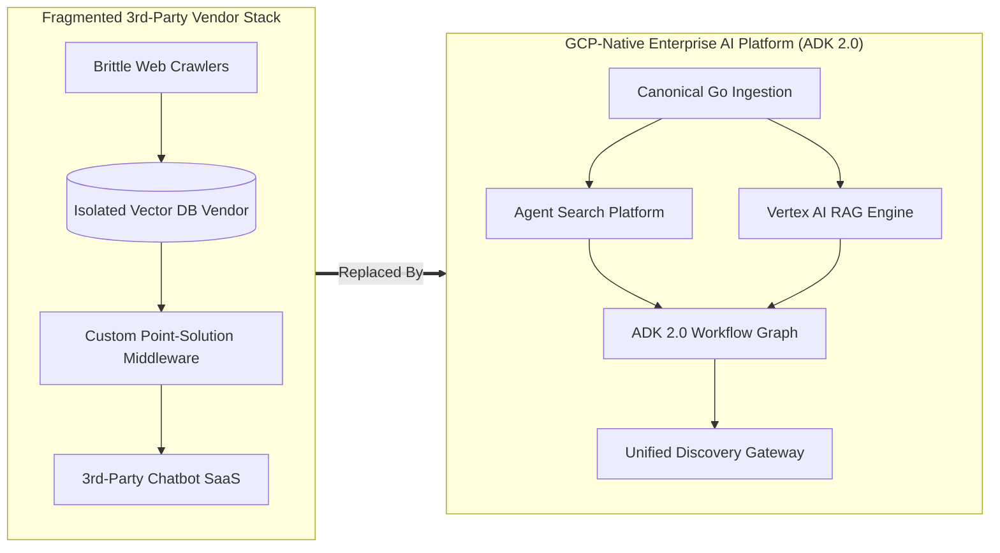
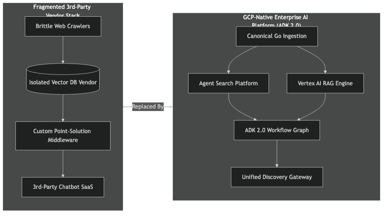
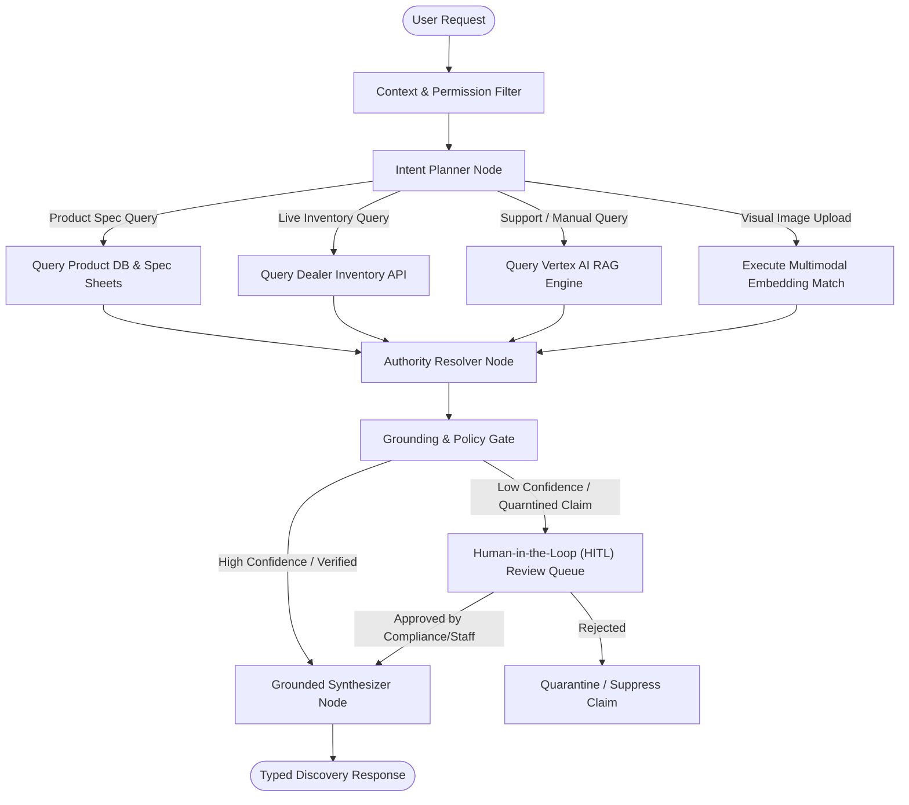
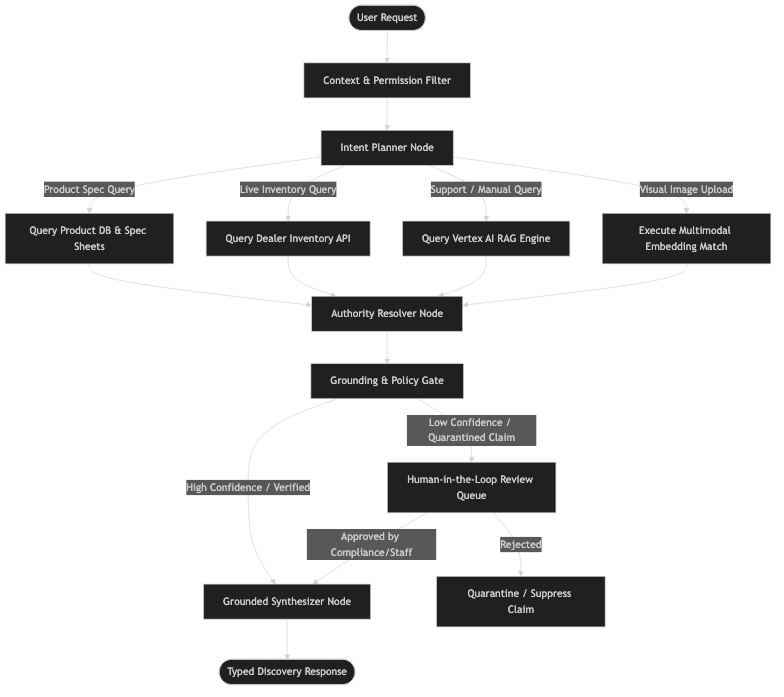
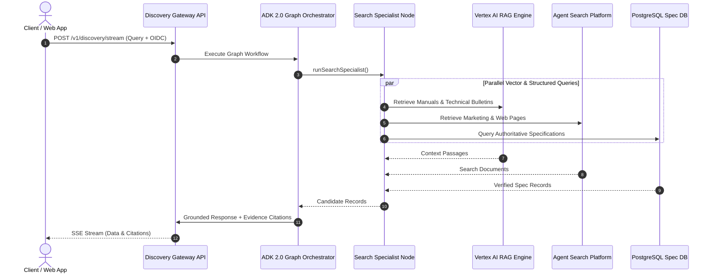
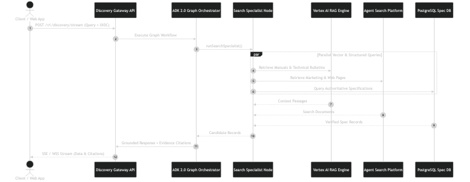
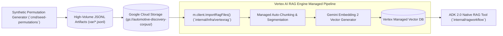
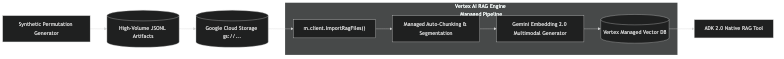
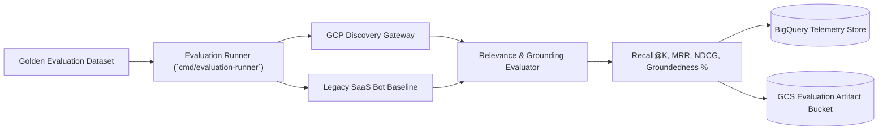
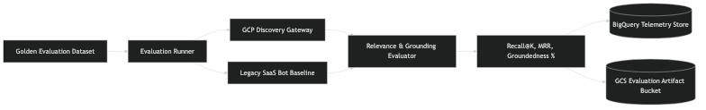

# Automotive Discovery Fabric

> A GCP-native reference platform for unified automotive marketing search, dealer inventory, parts fitment, multimodal retrieval, and grounded conversational experiences.

[](https://go.dev/)
[](https://cloud.google.com/)
[](#project-status)
[](LICENSE)

---

## Technical & Business Objectives

### Technical Objective

Eliminate fragile third-party chatbot integrations, proprietary connector middleware, and duplicated retrieval stacks by consolidating into a single **GCP-native enterprise discovery gateway**. Built in Go using **ADK 2.0 multi-agent workflow graphs**, **Agent Search**, **Vertex AI RAG Engine**, and direct SQL access, this architecture establishes a typed contract between backend services and generated frontend API clients.

### Business Objective

Reduce the **marginal integration cost** of onboarding new brands, marketing channels, dealer tools, and inventory feeds to zero:

```text
Marketing websites / CMS / product databases / support documents
                         ↓
             Canonical ingestion platform
                         ↓
       Agent Search data stores and indexes
                         ↓
            ADK 2.0 workflow graph
                         ↓
     Grounding, policy, reconciliation, actions
                         ↓
          Shared search and answer gateway
                         ↓
     Multi-brand websites (Apex / Meridian / Northstar / Voltline)
```

---

## What Going GCP-Native Replaces (Replacing 3rd-Party Vendor Platforms with Google's AI Infrastructure)

Fragmented third-party vendor platforms competing with Google's AI infrastructure often introduce proprietary silos, brittle scrapers, isolated vector stores, and custom point solutions. By consolidating onto a GCP-native foundation, this platform replaces disjointed vendor layers with managed, enterprise-grade Google Cloud infrastructure:





| Concern | Fragmented vendor model | Discovery Fabric model |
|---|---|---|
| Source integration | Repeated by use case or vendor | One reusable adapter per source |
| Authentication | Vendor credentials and duplicated configuration | Central identity, IAM, and workload identity |
| Data model | Vendor-specific schemas | Manufacturer-owned canonical contracts |
| Search indexes | Several disconnected copies | Shared projections from canonical records |
| Chat behavior | Bot-specific prompt and retrieval logic | Central workflow, policy, and evaluation |
| Source authority | Often implicit | Explicit per claim type |
| Freshness | Vendor-specific polling | Event-driven and observable |
| Evidence | Frequently absent or inconsistent | First-class source and evidence references |
| Cost | Licenses plus customization and professional services | Cloud usage plus internal platform ownership |
| Extensibility | Depends on vendor roadmap | New tools and engines implement internal interfaces |
| Migration | Client rewrites | Adapter replacement behind stable APIs |
| Evaluation | Per-vendor dashboards | One golden dataset and scorecard |

---

## Dynamic ADK 2.0 Workflow Graph & Human-in-the-Loop Architecture

The core orchestration uses [ADK 2.0 Go Workflow Graphs](https://adk.dev/2.0/) (`google.golang.org/adk/v2/workflow`) with receiver-based function nodes (`internal/agents/graph.go`). Rather than executing rigid linear chains, the graph dynamically plans retrieval across specialized agents based on user intent and real-time constraints:





### Key Graph Components:
- **Receiver-Based Function Nodes**: Statically compiled Go method handlers attached directly to core orchestrators, providing type-safe access to infrastructure adapters.
- **Dynamic Retrieval Fanout**: Parallel execution across Agent Search, Vertex AI RAG Engine, and direct PostgreSQL stores.
- **Human-in-the-Loop (HITL) Gate**: Quarantines unverified document-derived claims or low-confidence fitment assertions for staff review before publication.
- **Source Authority Hierarchy**: Enforces deterministic rules where direct database specifications override marketing copy or RAG text.





---

## High-Volume Ingestion & Vertex RAG Store Ingestion Architecture

When seeding millions of records (generated via `cmd/seed-permutations`), records follow a managed GCS-to-Vertex bulk ingestion pipeline rather than line-by-line API calls:





### Millions-Scale Ingestion Steps:
1. **JSONL Bulk Stream**: `cmd/seed-permutations` writes formatted JSONL records (e.g. `var/vertex_search_permutations.jsonl`).
2. **GCS Stage**: Uploaded to Google Cloud Storage (`gs://automotive-discovery-corpus/permutations/*.jsonl`).
3. **Async Bulk Import**: `ImportGCS()` in `internal/infra/vertexrag/adapter.go` triggers `ImportRagFilesRequest` against Vertex AI RAG Engine.
4. **Gemini Embedding 2.0 Multimodal Indexing**: GCP automatically parses, chunks, and generates unified multimodal embeddings (text, product photography, mechanical diagrams, installation videos, and PDF manuals) using **Gemini Embedding 2.0**, updating the Vertex Managed Vector DB asynchronously.
5. **Real-Time Graph Retrieval**: The ADK 2.0 workflow graph queries the corpus via `NativeRAGTool` with zero application-side vector management overhead.

---

## Domain Capabilities & Code Structure

Every business domain is isolated in explicit Domain-Driven Design (DDD) packages:

1. **`internal/product`**: Automotive parts catalog, OEM parts, aftermarket alternatives, and identifiers.
2. **`internal/vehicle`**: Vehicle models, year/trim configurations, MSRPs, and technical specs.
3. **`internal/dealer`**: Dealer organizations, facilities, latitude/longitude, and departments.
4. **`internal/inventory`**: Time-stamped stock observations, quantity tracking, and dealer locations.
5. **`internal/fitment`**: Provenance-backed compatibility assertions and conditional fitment rules.
6. **`internal/content`**: Marketing CMS items, support documents, owners manuals, and campaigns.
7. **`internal/discovery`**: Unified Answer and Discovery Gateway handling OIDC auth and grounding gates.
8. **`internal/agents`**: ADK 2.0 multi-agent workflow graph orchestration.

Each domain package owns its standalone SQL queries (`<package>/queries/query.sql`) and generates typed Go code via `sqlc`. OpenAPI annotations document every REST route to generate frontend TypeScript clients automatically.

---

## Continuous Evaluation & Production Artifact Persistence

A core architectural principle of this platform is **offline evaluation and artifact transparency**. In production search systems, continuous evaluation checks relevance and prevents grounding regressions.





### Production Evaluation Metrics
- **Recall@K & MRR**: Measures exact and semantic retrieval coverage against the golden benchmark.
- **Grounded Claim Rate**: Quantifies percentage of factual assertions supported by verified citations.
- **Source Authority Adherence**: Verifies that structured database specs always override marketing copy.
- **Artifact Persistence**: Evaluation runs automatically record JSON/Parquet execution artifacts to **Google Cloud Storage (GCS)** and stream telemetry metrics into **BigQuery** for automated regression detection in CI/CD pipelines.

Run local benchmark evaluations against simulated legacy bots using:

```bash
make eval
```

---

## Long-Term Business Use Cases & Enterprise Roadmap

Once implemented, this platform serves as the foundation for broader enterprise initiatives:

1. **Multi-Brand Marketing Personalization**: Serve consistent, authoritative responses across Apex Motors, Meridian Luxury, Northstar Motors, and Voltline EV digital properties without maintaining separate search backends.
2. **Dealer Parts & Accessories Portal**: Enable dealer technicians to look up compatible parts and stock availability with provenance-backed fitment assurances.
3. **Autonomous Customer Support**: Deflect repetitive support queries by grounding answers directly in verified owner manuals and technical bulletins via Vertex AI RAG Engine.
4. **Real-time Inventory Matching**: Bridge vehicle shopper search directly to live dealer inventory with geo-location awareness.
5. **Centralized Write Authority & Sales Operations (Planned Next Step)**: A unified management plane enabling authorized dealer staff and sales representatives to perform real-time inventory updates, hold vehicles for customers, and record stock observations with distributed transaction boundaries. *(Design phase complete; implementation planned as a 1-day follow-up phase).*

---

## Pre-Deployment Verification & POC Scope Boundaries

### Proof-of-Concept (POC) Nature & Production Next Steps
While this project provides a working **Proof-of-Concept (POC)** built against real **Google Cloud Platform (GCP)** and **Vertex AI** production components (`Agent Search`, `Vertex AI RAG Engine`, `Gemini Embedding 2.0`, and `ADK 2.0 Go Workflow Graphs`), specific enterprise use cases remain subject to business determination. The critical next steps for production deployment include:
- **Prompt Engineering & System Instruction Tuning**: Fine-tuning domain-specific system instructions, brand tone guidelines, and grounding prompt templates across graph workflow nodes.
- **Model Tuning & Few-Shot Evaluation**: Tailoring Gemini model parameters and few-shot examples for specialized automotive fitment and parts cross-referencing scenarios.
- **Load & Concurrency Testing**: High-throughput benchmarking under multi-tenant WSS / SSE streaming workloads (`/v1/discovery/ws` and `/v1/discovery/stream`).
- **GCP IAM & Workload Identity Validation**: Verification of production Cloud SQL Auth Proxy and Vertex AI IAM permission boundaries.
- **End-to-End RAG Corpus Validation**: Testing live chunking and vector distance thresholds against full-scale PDF owner manual collections in Vertex AI RAG Engine.

### Explicit Out-of-Scope for MVP
- Financial transactions, consumer checkout, and credit card processing.
- Live dealership management system (DMS) write-backs beyond local inventory observations.
- VIN decoding for non-synthetic vehicle configurations.
- Real-time consumer location tracking or Bluetooth beacon integration.

---

## Running & Verifying

To run the workspace unit test suite across all domains:

```bash
go test ./...
```

To run the local API server and seed synthetic test data:

```bash
make dev
make seed
```

---

## Disclaimer

This repository uses synthetic automotive brands, vehicle models, parts, and inventory records. 